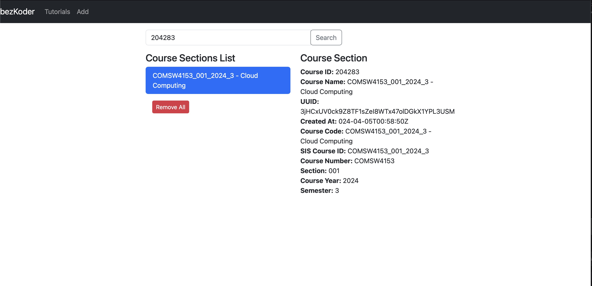

# Submission for W4153 - Project 1 (Cloud Computing)
Murat Gulcelik 
mg4377
HW0 - Cloud Computing

## 1. Database Repository Setup
### Steps to Set Up:
- Installed MySQL on my local machine.
- Created a database called `p1_database` using MySQL Workbench.
- Created the `course_sections` table using the provided SQL script.
- Inserted sample data (provided in the repo) into the `course_sections` table.
- Verified the database connection and ensured the table was set up correctly.

### Screenshot:

---

## 2. FastAPI Application Setup
### Steps to Set Up:
- Installed dependencies using:
  pip install fastapi uvicorn sqlalchemy mysql-connector-python pydantic
- Set up the FastAPI app with a MySQL database connection to `p1_database`.
- Defined the `course_sections` table as a SQLAlchemy model.
- Created CRUD endpoints for managing course sections.
- Ran the FastAPI app using:
  uvicorn main:app --reload
- Verified that the app was working correctly.

### Screenshot:

---

## 3. UI Repository Setup
### Steps to Set Up:
- Installed Angular following the official Angular documentation.
- Ran npm install to install all required dependencies for the Angular UI project.
- Started the Angular application using:
  ng serve
  - Confirmed that the UI connects with the FastAPI application and interacts with the MySQL database via the FastAPI backend.

### Screenshot:

---

## Final Notes:
- All three repositories (Database, Application, and UI) were set up successfully and integrated as described.
- The project is fully functional with end-to-end communication between the Angular UI, FastAPI application, and MySQL database.
