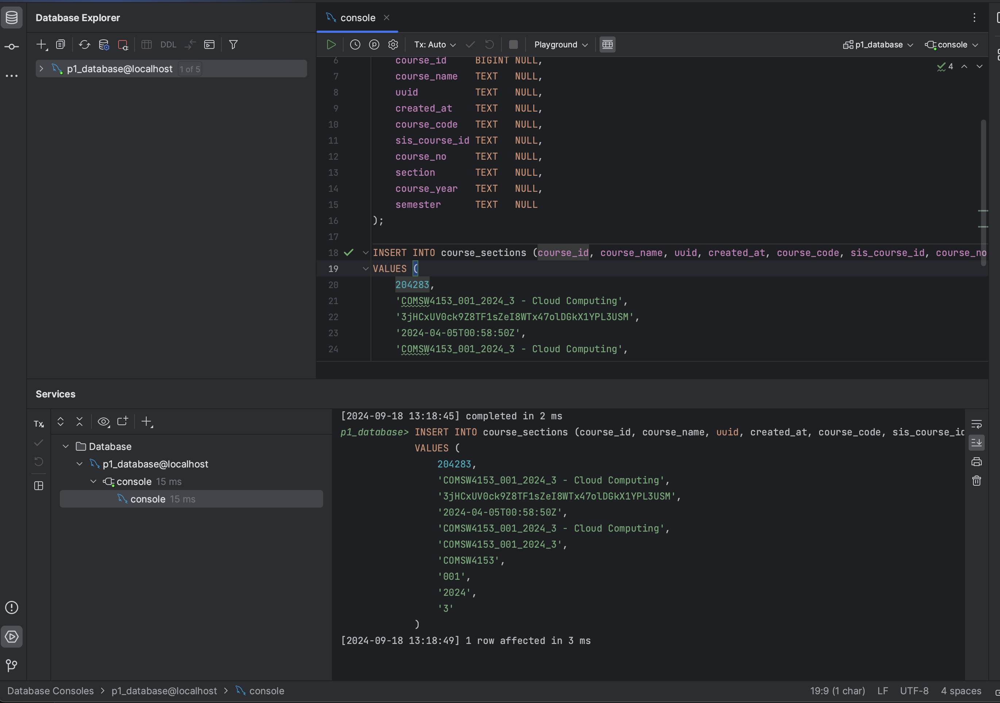
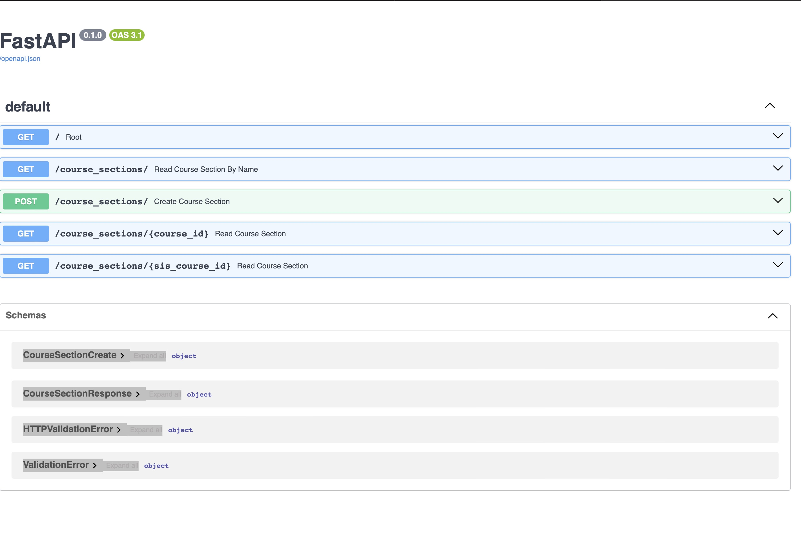
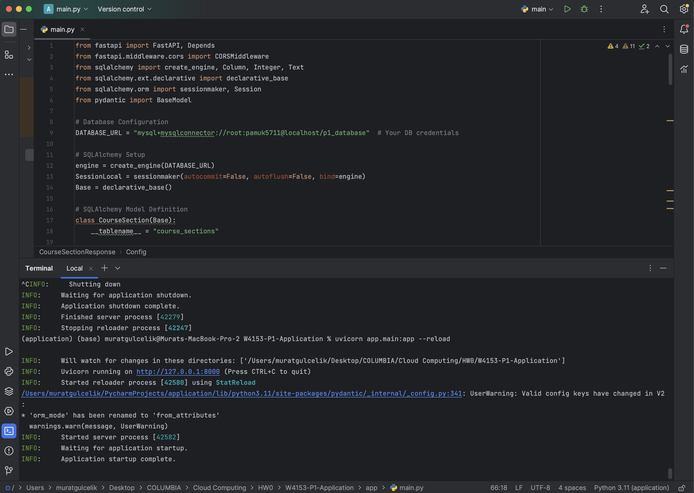

## Database

### Steps to Set Up the Database Repository

1. **Install MySQL**: 
   - Ensure that MySQL server is installed and running on your local machine. You can download it from the [MySQL website](https://dev.mysql.com/downloads/mysql/).

2. **Create the Database**: 
   - Open a MySQL client (like MySQL Workbench or the command line) and execute the following SQL commands to create the database and the required table:
   ```sql
   CREATE DATABASE IF NOT EXISTS p1_database;

   USE p1_database;

   CREATE TABLE IF NOT EXISTS course_sections (
       course_id     BIGINT NULL,
       course_name   TEXT   NULL,
       uuid          TEXT   NULL,
       created_at    TEXT   NULL,
       course_code   TEXT   NULL,
       sis_course_id TEXT   NULL,
       course_no     TEXT   NULL,
       section       TEXT   NULL,
       course_year   TEXT   NULL,
       semester      TEXT   NULL
   );

3. **Insert Sample Data**: 
   - provided in repo
  
4. **Verify Connection**: 
   - Use a MySQL client or command line to ensure that the database and tables are set up correctly by running:
  
Brief Summary of Section:

I installed MySQL on my local machine, created a database named p1_database, and set up the course_sections table with the necessary fields. I inserted sample data to test the application functionality and verified the connection by querying the table.

Screenshot: 

## Database Screenshot (Cloud Computing)




## FastAPI Application

### Setup Steps:
1. Install Dependencies:
   pip install fastapi uvicorn sqlalchemy mysql-connector-python pydantic

2. Set Up FastAPI:
   - I created a FastAPI app with a MySQL database connection (p1_database).
   - Defined the course_sections table and built API endpoints for CRUD operations.

3. Run the Application:
   uvicorn main:app --reload

4. Verify the setup by accessing the app at http://127.0.0.1:8000.

## Screenshot:
The screenshots of the working application are included:

- 
- 


